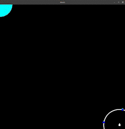

# Introduction

This project builds on the pre-existing generic GPU accelerated particle filter [library](https://github.com/connormcmonigle/particle-filter) to provide reference particle filters tailored for the RoboMaster robotics competition. The particle filter implementations provided by this library can either be used as reference when designing particle filters for real-time tracking applications or consumed directly as a Python library. Please refer to the generic GPU accelerated particle filter library's documentation for more details regarding the required steps to implement custom particle filters for real-time tracking applications.

# Demos

Interactive scripts demonstrating the provided particle filters can be found under the `demos` directory. Below is a real-time demonstration of the provided reference `plate_orbit` particle filter with 1M particles. The provided interactive demonstration scripts can also be referred to as a reference when directly consuming this library a la carte.

# Installation
- Initialize submodules with `git submodule update --init --recursive`.
- Ensure required build tools are installed (see `pyproject.toml`) and CUDA is installed.
- Run `python setup.py bdist_wheel`, using the python version you intend to target.
- Install the wheel with `python -m pip install dist/robomaster_particle_filters*.whl` using the same python version you used in the previous step.

